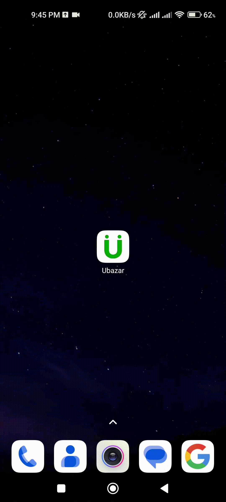
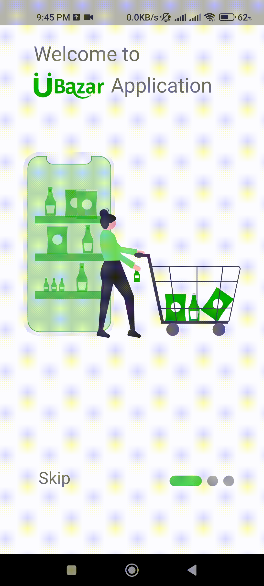
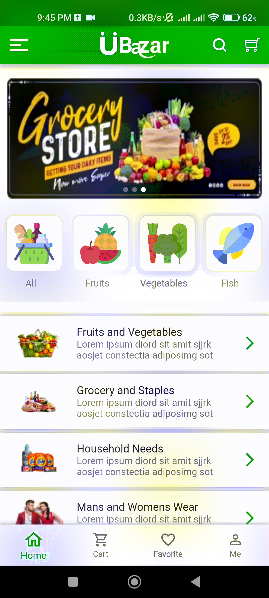
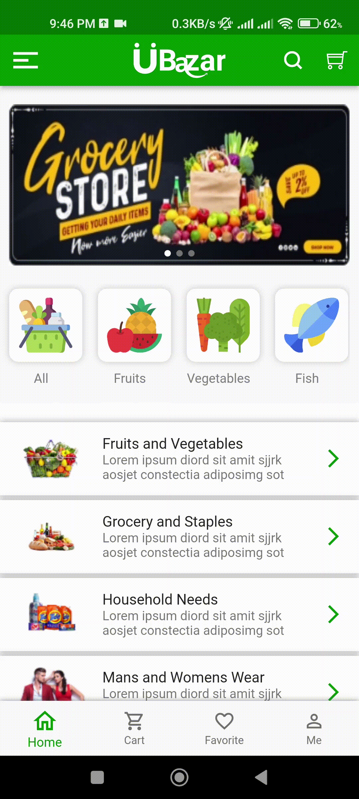

UBazar Application

<h3>In this application, I just built some functional UI for the UBazar application. This was done for a test.</h3>

<table style="width:100%">
  <tr>
    <td><h4>Splash Screen</h4>
</td>
    <td><h4>onboarding screen</h4>
</td>
    <td><h4>home page Cover Slider</h4>
 </td>
  </tr>
  
  <tr>
    <td><h4>Bottom Nevigation bar</h4>
</td>
    <td><h4>App drawer</h4>
 </td>
    <td><h4>App Exitr</h4>
</td>
  </tr>
</table>

